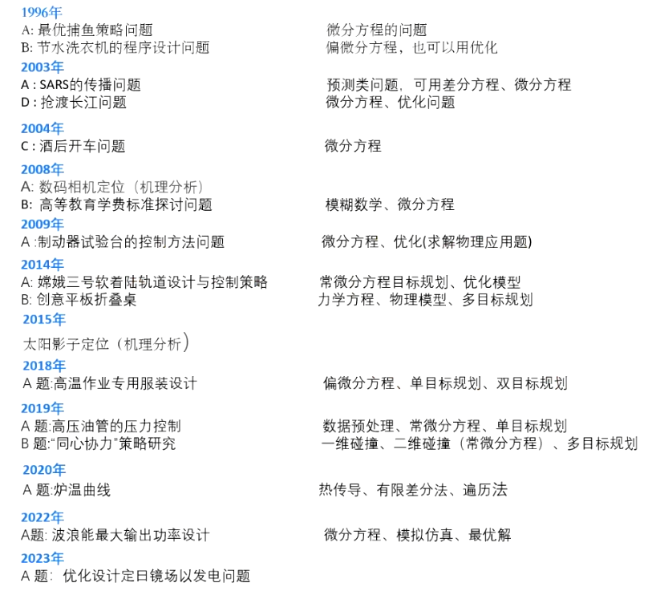

# 微分方程与差分方程

# 一、概述



| 年份    | 题目                                | 相关方法或理论                               |
| ------- | ----------------------------------- | -------------------------------------------- |
| 1996 年 | A: 最优捕鱼策略问题                 | 微分方程的问题                               |
|         | B: 节水洗衣机的程序设计问题         | 偏微分方程，也可以用优化                     |
| 2003 年 | A: SARS 的传播问题                  | 预测类问题，可用差分方程、微分方程           |
|         | D: 抢渡长江问题                     | 微分方程、优化问题                           |
| 2004 年 | C: 酒后开车问题                     | 微分方程                                     |
| 2008 年 | A: 数码相机定位（机理分析）         | 模糊数学、微分方程                           |
|         | B: 高等教育学费标准探讨问题         | 模糊数学、微分方程                           |
| 2009 年 | A: 制动器试验台的控制方法问题       | 微分方程、优化（求解物理应用题）             |
| 2014 年 | A: 缆坡三号软着陆轨道设计与控制策略 | 常微分方程目标规划、优化模型                 |
|         | B: 创意平板折叠桌                   | 力学方程、物理模型、多目标规划               |
| 2015 年 | 太阳影子定位（机理分析）            | 偏微分方程                                   |
| 2018 年 | A: 高温作业专用服装设计             | 偏微分方程、单目标规划、双目标规划           |
| 2019 年 | A: 高压油管的压力控制               | 数据预处理、常微分方程、单目标规划           |
|         | B: “同心协力”策略研究             | 二维碰撞、二维碰撞（常微分方程）、多目标规划 |
| 2020 年 | A: 沪温曲线                         | 热传导、有限差分法、遍历法                   |
| 2022 年 | A: 波浪能最大输出功率设计           | 微分方程、模拟仿真、最优解                   |
| 2023 年 | A: 优化设计启目镜场以及发电问题     | 微分方程、优化问题                           |

## 微分方程模型介绍

### 模型介绍

微分方程建模是数学建模的重要方法，因为许多实际问题的数学描述将导致求解微分方程的定解问题。解决相应问题可以按以下几步：

1. 根据实际要求确定要研究的量（自变量、未知函数、必要的参数等）并确定坐标系。
2. 找出这些量所满足的基本规律（物理的、几何的、化学的或生物学的等）。
3. 运用这些规律列出方程和定解条件。
4. 求解、分析结果。

### 列方程常见的方法

1. **微元分析法与任意区域上取积分的方法**

   通过微元分析法，利用已知的规律建立一些变量（自变量与未知函数）的微元之间的关系式，然后再通过取极限的方法得到微分方程，或等价地通过任意区域上取积分的方法来建立微分方程。
2. **按规律直接列方程**

   在数学、力学、物理、化学等学科中许多自然现象所满足的规律已为人们所熟悉，并直接由微分方程所描述。我们常利用这些规律对某些实际问题列出微分方程。
3. **模拟近似法**

   在生物、经济等学科中，许多现象所满足的规律并不很清楚且相当复杂，因此需要根据实际资料或大量的实验数据，提出各种假设。在一定的假设下，给出实际现象所满足的规律，然后利用适当的数学方法列出微分方程。

### 例题

一个较热的物体置于室温为 18°C 的房间内，该物体最初的温度是 60°C，3 分钟以后降到 50°C。想知道它的温度降到 30°C 需要多少时间？10 分钟以后它的温度是多少？

**牛顿冷却（加热）定律**：将温度为 $T$ 的物体放入处于常温 $m$ 的介质中时, $T$ 的变化速率正比于 $T$ 与周围介质的温度差。

牛顿冷却定律描述了物体温度随时间变化的过程。根据牛顿冷却定律，温度 $$T(t)$$ 随时间 $t$ 的变化满足以下微分方程：

$$
\frac{dT}{dt} = -k(T - m)
$$

其中：

- $$T(t)$$ 是物体在时间 $t$ 时的温度。
- $m$ 是环境温度。
- $k$ 是冷却常数，取决于物体和环境的性质。

我们可以通过积分这个方程得到 $$T(t)$$ 的表达式：

$$
T(t) = m + (T_0 - m) e^{-kt}
$$

其中：

- $$T_0$$ 是物体的初始温度。

我们根据给定条件来求解这个问题。具体步骤如下：

1. 根据初始条件求解冷却常数 $$k$$。
2. 使用 $$k$$ 求解物体温度降到 30°C 所需的时间。
3. 计算 10 分钟后物体的温度。


```python
import numpy as np

# 已知条件
T0 = 60  # 初始温度
T1 = 50  # 3分钟后的温度
T_room = 18  # 环境温度
time1 = 3  # 时间为3分钟

# 求解冷却常数k
k = -np.log((T1 - T_room) / (T0 - T_room)) / time1

# 求解降到30度所需的时间
T_target = 30
time_to_target = -np.log((T_target - T_room) / (T0 - T_room)) / k

# 计算10分钟后的温度
time2 = 10
T_after_10_minutes = T_room + (T0 - T_room) * np.exp(-k * time2)

# 输出结果
print(f"物体温度降到30°C所需的时间为: {time_to_target:.2f} 分钟")
print(f"10分钟后物体的温度为: {T_after_10_minutes:.2f} °C")
```

# 二、传染病模型

## 背景与问题

- 描述传染病的传播过程。
- 分析受感染人数的变化规律。
- 预报传染病高潮到来的时刻。
- 预防传染病蔓延的手段。

> 基本方法:按照传播过程的一般规律建立数学模型


### 模型 1：I 模型

已感染人数（病人）记为 $$i(t)$$

假设：每个病人每天有效接触（足以使人致病）人数为 $\lambda$。

建模：

> 求解采用的是分离变量法

$$
i(t + \Delta t) - i(t) = i(t) \lambda \Delta t
$$

$$
\frac{di}{dt} = \lambda i
$$

$$
i(0) = i_0
$$

求解、分析、检验：

$$
\frac{di}{dt} = \lambda i
$$

$$
i(0) = i_0
$$

$$
i(t) = i_0 e^{\lambda t}
$$

$$
t \rightarrow \infty \Rightarrow i(t) \rightarrow \infty
$$


> 显然这个模型的结果是不合理的,感染人数不可能超过总人数。
> 若有效接触的是病人，则不能使病人数增加。
> 必须区分已感染者和未感染者以及总人数。

#### 代码

```matlab
%创建一个.m文件并命名为i_model.m
% I Model
function [t, i] = i_model(i0, lambda, tmax)
    [t, i] = ode45(@(t, i) lambda * i, [0 tmax], i0);
end
```

> 注意:要创建两个文件,上面的代码创建的是 matlab 的函数文件

```matlab
% 设置参数
i0 = 1;  % 初始感染人数
lambda = 0.5;  % 每天有效接触人数
tmax = 20;  % 模拟时间

% 求解模型
[t, i] = i_model(i0, lambda, tmax);

% 绘图
figure;
plot(t, i);
title('I Model');
xlabel('Time');
ylabel('Infected Population');
```

### 模型 2：SI 模型

区分已感染者和未感染者

假设：

1. 总人数 $N$ 不变，病人和健康人的**比例**分别为 $$i(t), s(t)$$。

> 注意这里 $i(t)$ 表示的是比例和上一个模型表示人数是不一样的

1. 每个病人每天有效接触人数为 $\lambda$，且使接触的健康人致病。

建模：

$$
N[i(t + \Delta t) - i(t)] = N i(t) \lambda \Delta t s(t)
$$

$$
\frac{di}{dt} = \lambda s i
$$

$$
s(t) + i(t) = 1
$$

求解、分析、检验：

$$
\begin{cases}
\frac{di}{dt} = \lambda i (1 - i) \\
i(0) = i_0
\end{cases}
$$

$$
\int \frac{di}{i(1 - i)} = \int \lambda dt
$$

$$
i(t) = \frac{1}{1 + \left(\frac{1}{i_0} - 1\right)e^{-\lambda t}}
$$


$$t = t_m$$ 时, $$\frac{di}{dt}$$ 最大

$t_m \sim$ 传染病高峰到来的时刻

$$
t_m = \lambda^{-1} \ln \left(\frac{1}{i_0} - 1\right)
$$

$$
\lambda \downarrow \rightarrow t_m \uparrow
$$

$$
t \rightarrow \infty \Rightarrow i \rightarrow 1
$$

#### 代码

```matlab
%创建一个.m文件并命名为si_model.m
% SI Model
function [t, y] = si_model(i0, lambda, tmax)
    [t, y] = ode45(@(t, y) [lambda * y(1) * (1 - y(1))], [0 tmax], i0);
end
```

> 注意:要创建两个文件,上面的代码创建的是 matlab 的函数文件

```matlab
% 设置参数
i0 = 0.1; % 初始感染比例
lambda = 0.5; % 每天有效接触人数
tmax = 50; % 模拟时间

% 求解模型
[t, i] = si_model(i0, lambda, tmax);

% 找到 infected 和 susceptible 比例为 0.5 的时间点
infected_half = interp1(i, t, 0.5);
susceptible_half = interp1(1-i, t, 0.5);

% 绘图
figure;
plot(t, i, 'b', 'LineWidth', 2);
hold on;
plot(t, 1-i, 'r', 'LineWidth', 2);

% 标记 infected 和 susceptible 比例为 0.5 的点
plot(infected_half, 0.5, 'bo', 'MarkerSize', 10, 'MarkerFaceColor', 'b');
plot(susceptible_half, 0.5, 'ro', 'MarkerSize', 10, 'MarkerFaceColor', 'r');

% 添加标记点的文本说明
text(infected_half, 0.55, ['t_mi = ', num2str(infected_half, '%.2f')], 'Color', 'b', 'HorizontalAlignment', 'right');
text(susceptible_half, 0.55, ['t_ms = ', num2str(susceptible_half, '%.2f')], 'Color', 'r', 'HorizontalAlignment', 'left');
      
title('SI Model');
xlabel('Time');
ylabel('Population Ratio');
legend('Infected', 'Susceptible', 'Location', 'north');

% 添加水平线以突出 0.5 比例
yline(0.5, '--k', 'LineWidth', 1);

% 计算传染病高峰时刻
tm = 1/lambda * log((1/i0) - 1);
disp(['Peak time: ', num2str(tm)]);

% 设置坐标轴范围，确保标记点可见
ylim([0 1.1]);
```

### 模型 3：SIS 模型

考虑病人自愈且可再次被感染

传染病无免疫性——病人治愈成为健康人，健康人可再次被感染。

增加假设：

病人每天治愈的比例为 $\mu$

$\lambda \sim$ 日接触率

$\mu \sim$ 日治愈率

$$
\sigma = \lambda / \mu
$$

建模：

$$
N[i(t + \Delta t) - i(t)] = Ni(t)\lambda \Delta t s(t) - Ni(t) \mu \Delta t
$$

$$
\begin{cases}
\frac{di}{dt} = \lambda i (1 - i) - \mu i = -\lambda i \left[i - \left(1 - \frac{1}{\sigma}\right)\right] \\
i(0) = i_0
\end{cases}
$$

求解分析检验:

$$
\frac{di}{dt} = -\lambda i \left[i - \left(1 - \frac{1}{\sigma}\right)\right]
$$


#### 代码

```matlab
%创建一个.m文件并命名为sis_model.m
% SIS Model
function [t, y] = sis_model(i0, lambda, mu, tmax)
    [t, y] = ode45(@(t, y) [lambda * y(1) * (1 - y(1)) - mu * y(1)], [0 tmax], i0);
end
```

> 注意:要创建两个文件,上面的代码创建的是 matlab 的函数文件

```matlab
% 设置参数
i0 = 0.01;  % 初始感染比例
lambda = 0.5;  % 每天有效接触人数
mu = 0.1;  % 每天治愈比例
tmax = 100;  % 模拟时间

% 求解模型
[t, i] = sis_model(i0, lambda, mu, tmax);

% 绘图
figure;
plot(t, i);
hold on;
plot(t, 1-i);
title('SIS Model');
xlabel('Time');
ylabel('Population Ratio');
legend('Infected', 'Susceptible');

% 计算平衡点
equilibrium = 1 - mu/lambda;
disp(['Equilibrium point: ', num2str(equilibrium)]);

% 情况1: σ > 1
lambda1 = 0.5;
mu1 = 0.2;
[t1, i1] = sis_model(i0, lambda1, mu1, tmax);

% 情况2: σ ≤ 1
lambda2 = 0.2;
mu2 = 0.5;
[t2, i2] = sis_model(i0, lambda2, mu2, tmax);

% 绘图
figure;
subplot(1,2,1);
plot(t1, i1);
title('SIS Model: σ > 1');
xlabel('Time');
ylabel('Infected Ratio');
yline(1 - mu1/lambda1, '--r', 'Equilibrium');

subplot(1,2,2);
plot(t2, i2);
title('SIS Model: σ ≤ 1');
xlabel('Time');
ylabel('Infected Ratio');

% 显示R₀值
disp(['R₀ (Case 1): ', num2str(lambda1/mu1)]);
disp(['R₀ (Case 2): ', num2str(lambda2/mu2)]);
```

### 模型 4：SIR 模型

传染病有免疫性——病人治愈后即移出感染系统，称为**移出者**。

假设：

1. 总人数 $N$ 不变，病人、健康人和移出者的比例分别为 $i(t), s(t), r(t)$。
2. 病人的日接触率 $\lambda$, 日治愈率 $\mu$, 接触数 $\sigma = \lambda / \mu$

建模：

$$
s(t) + i(t) + r(t) = 1
$$

需要建立 $i(t), s(t), r(t)$ 的两个方程。

$$
N[r(t + \Delta t) - r(t)] = Ni(t) \mu \Delta t
$$

$$
N[i(t + \Delta t) - i(t)] = Ni(t)\lambda \Delta t s(t) - Ni(t) \mu \Delta t
$$

$$
N[s(t + \Delta t) - s(t)] = -\lambda Ns(t)i(t) \Delta t
$$

$$
i_0 + s_0 \approx 1 \quad (通常r(0) = r_0 很小)
$$

求解分析检验:

$$
\begin{cases}
\frac{di}{dt} = \lambda si - \mu i \\
\frac{ds}{dt} = -\lambda si \\
i(0) = i_0, \quad s(0) = s_0\\
i_0 + s_0 \approx 1 \quad (通常r(0) = r_0 很小)
\end{cases}
$$

> 由于无法求出 $i(t), s(t)$ 的解析解。
> 我们考虑其他办法:
>
> 1. 数值计算
> 2. 定性分析
>    相平面上研究解析性质。

#### SIR 模型的数值解

设 $\lambda = 1$ , $\mu = 0.3$ , $i_0 = 0.02$, $s_0 = 0.98$, 用 MATLAB 计算作图 $i(t)$, $s(t)$ 及 $i(s)$

$$
\frac{di}{ds} = \frac{\lambda si - \mu i}{-\lambda si}
$$


#### 模型的相轨线分析

对于前面求解分析检验的方程组

消去 $dt$, $\sigma = \lambda / \mu$

$$
\begin{cases}
\frac{di}{ds} = \frac{1}{\sigma s} - 1 \\
i \big|_{s = s_0} = i_0
\end{cases}
$$

相轨线: $i(s) = (s_0 + i_0) - s + \frac{1}{\sigma} \ln \frac{s}{s_0}$

相轨线 $i(s)$ 的定义域：

$$
D = \{(s, i) | s \geq 0, i \geq 0, s + i \leq 1\}
$$

$s(t)$ 单调递减 $\rightarrow$ 相轨线的方向


#### 预防传染病蔓延的手段

传染病不蔓延的条件—— $s_0 < 1/\sigma$

- 提高阈值 $1/\sigma$

  - 降低 $\sigma$
  - $\lambda$ (日接触率) $\downarrow \rightarrow$ 卫生水平 $\uparrow$
  - $\mu$ (日治愈率) $\uparrow \rightarrow$ 医疗水平 $\uparrow$
- 降低 $s_0$

  - 提高 $r_0$ $\rightarrow$ 群体免疫

$$
s_0 + i_0 + r_0 = 1
$$

#### 代码

```matlab
%创建一个.m文件并命名为i_model.m
% SIR Model
function [t, y] = sir_model(i0, s0, lambda, mu, tmax)
    [t, y] = ode45(@(t, y) [
        lambda * y(1) * y(2) - mu * y(1)  % di/dt
        -lambda * y(1) * y(2)  % ds/dt
        mu * y(1)  % dr/dt
    ], [0 tmax], [i0; s0; 1-i0-s0]);
end
```

> 注意:要创建两个文件,上面的代码创建的是 matlab 的函数文件

```matlab
% 设置参数
i0 = 0.01;  % 初始感染比例
s0 = 0.99;  % 初始易感比例
lambda = 0.5;  % 每天有效接触人数
mu = 0.1;  % 每天治愈比例
tmax = 100;  % 模拟时间

% 求解模型
[t, y] = sir_model(i0, s0, lambda, mu, tmax);

% 绘图
figure;
plot(t, y);
title('SIR Model');
xlabel('Time');
ylabel('Population Ratio');
legend('Infected', 'Susceptible', 'Removed');

% 相平面图
figure;
plot(y(:,2), y(:,1));
title('SIR Model Phase Plane');
xlabel('Susceptible');
ylabel('Infected');

% 计算R0
R0 = lambda / mu;
disp(['R0: ', num2str(R0)]);
```

# 三、香烟过滤嘴的作用模型

## 问题

- 过滤嘴的作用与它的材料和长度有什么关系？
- 人体吸入的毒物量与哪些因素有关，其中什么因素影响大，什么因素影响小？

## 模型分析

- 分析吸烟时毒物进入人体的过程，建立吸烟过程的数学模型。

## 模型假设

1. $l_1 \sim$ 烟草长, $l_2 \sim$ 过滤嘴长, $l = l_1 + l_2$, 毒物总量 $M$ 均匀分布，密度 $w_0 = M/l$。
2. 点燃处毒物进入空气和沿香烟穿行的数量比是 $a : a'$, $a' + a = 1$。
3. 未点燃的烟草和过滤嘴对穿行的毒物的单位时间吸收速率分别是 $b$ 和 $\beta$。
4. 烟雾沿香烟穿行速度是常数 $v$, 香烟燃烧速度是常数 $u$, $v \gg u$。


## 模型建立

$t = 0, x = 0$, 点燃香烟

$q(x,t) \sim$ 毒物在 $x$ 处的流速（单位时间的流量）

$w(x,t) \sim$ 毒物密度

$$
w(x,0) = w_0
$$

$$
Q = \int_0^T q(l, t) dt, \quad T = l_1 / u
$$

1. 求 $q(x,t)$

流量守恒：

$$
\begin{cases}
q(x,t) - q(x+\Delta x,t) = \frac{q(x,t)b\Delta x}{v}, & ut \leq x \leq l_1 \\
q(x,t) - q(x+\Delta x,t) = \frac{q(x,t)\beta\Delta x}{v}, & l_1 \leq x \leq l
\end{cases}
$$

$$
\frac{dq(x,t)}{dx} = 
\begin{cases}
-\frac{b}{v}q(x,t), & ut \leq x \leq l_1 \\
-\frac{\beta}{v}q(x,t), & l_1 \leq x \leq l
\end{cases}
$$

定解条件: 

$$
q(ut,t) = auw(ut,t)
$$

1. 求 $w(ut,t)$ 考察 $\Delta t$ 内毒物密度的增量

$$
w(x, t + \Delta t) - w(x, t) = \frac{q(x,t)\Delta t b\Delta t}{v\Delta t}
$$

其中： $q(x,t) = auw(ut,t)e^{-\frac{b(x-ut)}{v}}$

$$
\begin{cases}\frac{\partial w(ut,t)}{\partial t} = \frac{b}{v}auw(ut,t)e^{-\frac{b(x-ut)}{v}}\\
w(x,0)=w_0
\end{cases}
$$

$$
w(ut,t) = \frac{w_0}{a'}\left(1 - ae^{-\frac{a'but}{v}}\right), \quad a' = 1-a
$$

1. 计算 $Q$~吸一支烟毒物进入人体总量

$$
w(ut,t) = \frac{w_0}{a'}\left(1 - ae^{-\frac{a'but}{v}}\right)
$$

$$
q(l,t) = auw(ut,t)e^{-\frac{b l_1-wt}{v}}e^{-\frac{\beta l_2}{v}}\\
$$

$$
Q = \int_0^{l_1/u} q(l,t) dt = \frac{auw_0}{a'b} e^{-\frac{\beta l_2}{v}}\left(1 - e^{-\frac{a'bl_1}{v}}\right)
$$

$$
Q = aMe^{-\frac{\beta l_2}{v}} \varphi(r), \quad r = \frac{a'bl_1}{v}, \quad \varphi(r) = \frac{1 - e^{-r}}{r}
$$

## 结果分析

1. $Q$ 与 $a, M$ 成正比。( $aM$ 是毒物集中在 $x = l_1$ 处的吸入量)
2. $e^{-\frac{\beta l_2}{v}} \sim$ 过滤嘴因素, $\beta, l_2 \sim$ 负指数作用
3. $\varphi(r) \sim$ 烟草的吸收作用 （烟草为什么有作用？）

$$
r = \frac{a'bl_1}{v} \ll 1
$$

$$
\varphi(r) = 1 - \frac{r}{2}
$$

$$
Q = aMe^{-\frac{\beta l_2}{v}}\left(1 - \frac{a'bl_1}{2v}\right), \quad b,l_1 \sim \text{线性作用}
$$

1. 与另一支不带过滤嘴的香烟比较，$$w_0, b, a, v, l$$ 均相同，吸至 $x = l_1$ 抛掉。

**带过滤嘴**:

$$
Q_1 = \frac{a w_0 v}{a' b} e^{-\frac{\beta l_2}{v}} \left(1 - e^{-\frac{a' b l_1}{v}}\right)
$$

**不带过滤嘴**:

$$
Q_2 = \frac{a w_0 v}{a' b} \left(1 - e^{-\frac{a' b l_1}{v}}\right)
$$

$$
\frac{Q_1}{Q_2} = e^{-\frac{(\beta - b) l_2}{v}}
$$

$$
\beta > b \Rightarrow Q_1 < Q_2
$$

提高 $\beta b$ 与加长 $l_2$，效果相同。

## 总结

- 引入两个基本函数：流量 $q(x,t)$ 和密度 $w(x,t)$，运用物理学的守恒定律通过微元方法建立微分方程，构造动态模型。
- 对求解结果进行定性和定量分析，得到合理的实际结论。


## 代码

```matlab
import numpy as np
import matplotlib.pyplot as plt

# 参数设置
M = 1.0  # 毒物总量 (任意单位)
a = 0.5  # 毒物进入空气和穿行的比例 (a = 0.5, a' = 0.5)
b = 0.1  # 烟草的吸收系数
beta = 0.8  # 过滤嘴的吸收系数, 增大以突出非线性效果
v = 1.0  # 烟雾穿行速度
l1 = 1.0  # 烟草长度
l2_values = np.linspace(0, 10, 100)  # 过滤嘴长度的变化范围, 增大以观察非线性效果

# 计算 Q1 和 Q2
def calculate_Q(l1, l2, a, M, b, beta, v):
    a_prime = 1 - a
    r = a_prime * b * l1 / v
    Q1 = (a * M * v / (a_prime * b)) * np.exp(-beta * l2 / v) * (1 - np.exp(-r))
    Q2 = (a * M * v / (a_prime * b)) * (1 - np.exp(-r))
    return Q1, Q2

Q1_values = []
Q2_values = []
for l2 in l2_values:
    Q1, Q2 = calculate_Q(l1, l2, a, M, b, beta, v)
    Q1_values.append(Q1)
    Q2_values.append(Q2)

# 比较有过滤嘴和无过滤嘴的毒物量
Q1_values = np.array(Q1_values)
Q2_values = np.array(Q2_values)
Q_ratio = Q1_values / Q2_values

# 绘图
plt.figure(figsize=(10, 6))
plt.plot(l2_values, Q1_values, label='Q1 (With Filter)')
plt.plot(l2_values, Q2_values, label='Q2 (Without Filter)')
plt.plot(l2_values, Q_ratio, label='Q1/Q2 Ratio', linestyle='--')
plt.xlabel('Filter Length l2')
plt.ylabel('Toxin Amount Q')
plt.title('Effect of Filter Length and Material on Toxin Inhalation')
plt.legend()
plt.grid(True)
plt.show()
```

# 四、烟雾的扩散与消失模型

## 现象和问题

- 炮弹在空中爆炸，烟雾向四周扩散，形成圆形不透光区域。
- 不透光区域不断扩大，然后区域边界逐渐明亮，区域缩小，最后烟雾消失。
- 建立模型描述烟雾扩散和消失过程，分析消失时间与各因素的关系。

## 问题分析

- 无穷空间由瞬时点源导致的扩散过程，用二阶偏微分方程描述烟雾浓度的变化。
- 观察到的烟雾消失与烟雾对光线的吸收，以及仪器对明暗的灵敏度有关。

## 模型假设

1. 扩散服从扩散定律。
2. 光线穿过烟雾时光强的相对减少与与烟雾浓度成正比；无烟雾的大小不影响光强。
3. 穿过烟雾进入仪器的光线只有明暗之分，明暗界限由仪器灵敏度决定。

## 模型建立

**扩散定律**：单位时间通过单位法向面积的流量 $q$ 与浓度 $C$ 的梯度成正比。

$$
q = -k \cdot \nabla C
$$

烟雾浓度 $C(x,y,z,t)$ 的变化规律

$[t,t+\Delta t]$ 通过 $\Omega$ 流出量 $Q_1 = \int_{t}^{t+\Delta t} \iint_S q \cdot n d \sigma dt$ 

$\Omega$ 内烟雾改变量 $Q_2 = \iiint_{v} [C(x,y,z,t+\Delta t) - C(x,y,z,t)] dV$

高斯公式:

$$
\iint_S q \cdot n d\sigma = \iiint_V \text{div } q dV = -k \iiint_V \text{div } (\nabla C) dV
$$

$$
Q_2 = -Q_1
$$

$$
\frac{\partial C}{\partial t} = k [\text{div}(\nabla C)] = k \left(\frac{\partial^2 C}{\partial x^2} + \frac{\partial^2 C}{\partial y^2} + \frac{\partial^2 C}{\partial z^2}\right)
\\ -\infty< x,y,z < \infty, t>0
$$

## 初始条件

$$
C(x, y, z, 0) = Q \delta(x, y, z)
$$

- $Q \sim$ 炮弹释放的烟雾总量
- $\delta \sim$ 单位强度的点源函数

求解方程:

$$
C(x, y, z, t) = \frac{Q}{(4 \pi kt)^{3/2}} e^{-\frac{x^2 + y^2 + z^2}{4 kt}}
$$

## 光强穿过烟雾时的变化规律

- $I(l) \sim$ 沿 $l$ 方向的光强
- $C(l) \sim$ 沿 $l$ 方向的烟雾浓度

假设光强的相对减少与烟雾浓度成正比。

$$
\frac{dI(l)}{dl} = -\alpha C(l) I(l)
$$

记未进入烟雾($l \leq l_0$)时光强为 $I(l_0) = I_0$:

$$
I(l) = I_0 e^{-\alpha \int_{l_0}^{l} C(s) ds}
$$

## 仪器灵敏度与烟雾明暗界限

- 烟雾浓度连续变化
- 烟雾中光强连续变化。
- 穿过烟雾进入仪器的光线只有明暗之分，明暗界限由仪器灵敏度决定。

$\mu \sim$ 仪器灵敏度，当 $I/I_0 < 1 - \mu$，观测结果为暗。

设光源在 $z = -\infty$，仪器在 $z = \infty$，则观测到的明暗界限为:

$e^{-\alpha \int_{-\infty}^{\infty} C(x,y,z,t) dz} = 1 - \mu$ $\sim$ 不透光区域边界

### 求解方程

$$
C(x, y, z, t) = \frac{Q}{(4 \pi kt)^{3/2}} e^{-\frac{x^2 + y^2 + z^2}{4 kt}}
$$

$$
\Rightarrow \int_{-\infty}^{\infty} C(x,y,z,t) dz = \frac{1}{\alpha} \ln \frac{1}{1-\mu} \approx \frac{\mu}{\alpha} \quad (\mu \text{ 很小})
$$

而 $\quad \int_{-\infty}^{\infty} C(x,y,z,t) dz = \frac{Q}{4 \pi kt} e^{-\frac{x^2 + y^2}{4kt}}$

$$
\frac{Q}{4 \pi kt} e^{-\frac{x^2 + y^2}{4 kt}} = \frac{\mu}{\alpha}
$$

不透光区域边界半径:

$$
r(t) = \sqrt{4 kt \ln \frac{\alpha Q}{4 \pi k \mu t}}
$$

### 结果分析

$$
r(t) = \sqrt{4 kt \ln \frac{\alpha Q}{4 \pi k \mu t}}
$$

$$
t = t_1 = \frac{\alpha Q}{4 \pi k \mu e}, \quad r = r_m = \sqrt{\frac{Q}{\pi \mu e}} \quad (\text{最大值})
$$

$$
t = t_2 = \frac{\alpha Q}{4 \pi k \mu}, \quad r = 0
$$

$$
\alpha \uparrow, Q \uparrow, \mu \downarrow \Rightarrow t_1 \uparrow, r_m \uparrow
$$

$$
k \downarrow \Rightarrow t_1 \uparrow
$$


| 参数                           | 数值   |
| ------------------------------ | ------ |
| 最大不透光区域边界半径 $r_{max}$ | 3.4220 |
| 边界达到最大值的时间 $t_1$       | 2.9275 |
| 烟雾完全消失的时间 $t_2$       | 7.9577 |

观测到不透光区域边界达到最大的时刻 $t_1$, 可以预报烟雾消失的时刻 $t_2$

> 1. **蓝色曲线**$r(t) = \sqrt{4kt \ln \left(\frac{\alpha Q}{4\pi k \mu t}\right)}$:
>    - 该曲线表示不透光区域的边界半径 $r(t)$随时间 $ t$ 的变化。
>    - 在爆炸初始时刻，烟雾边界迅速扩散，边界半径增大。
>    - 随着时间的推移，边界半径达到一个最大值，然后开始减小，直到最后烟雾完全消失。
> 2. **红色虚线**(垂直线) $t_1 = \frac{\alpha Q}{4 \pi k \mu e} $:
>    - 这条红色虚线表示边界半径达到最大值的时间$ t_1$。
>    - 从图中可以看到，边界半径在此时刻 $t_1$达到了峰值。
> 3. **绿色虚线**(水平线) $r_m = \sqrt{\frac{Q}{\pi \mu e}}$:
>    - 这条绿色虚线表示不透光区域边界的最大半径 $r_m$。
>    - 该半径在 $ t_1$ 时刻达到，这是烟雾扩散过程中的最大范围。
> 4. **蓝色虚线**(垂直线) $t_2 = \frac{\alpha Q}{4 \pi k \mu}$:
>    - 这条蓝色虚线表示烟雾完全消失的时间 $t_2 $。
>    - 此时，边界半径 $r(t)$ 已经缩小至零，意味着烟雾已经完全消散。

## 代码

```python
import numpy as np
import matplotlib.pyplot as plt

# 定义常数(这些常数可以根据特定情况进行设置)
k = 1.0  # 扩散系数
alpha = 1.0  # 参数alpha
Q = 1.0  # 炮弹释放的烟雾总量
mu = 0.01  # 仪器灵敏度
pi = np.pi

# 定义不透光区域边界半径 r(t)
def r(t):
    return np.sqrt(4 * k * t * np.log(alpha * Q / (4 * pi * k * mu * t)))

# 计算最大边界半径和相关时间点
t1 = alpha * Q / (4 * pi * k * mu * np.e)
r_max = np.sqrt(Q / (pi * mu * np.e))
t2 = alpha * Q / (4 * pi * k * mu)

# 时间范围
t = np.linspace(0.1, t2 * 1.5, 500)  # 从小于 t2 的时间开始

# 绘制不透光区域边界随时间的变化
plt.figure(figsize=(10, 6))
plt.plot(t, r(t), label=r'$r(t) = \sqrt{4 kt **\l**n **\f**rac{**\a**lpha Q}{4 **\p**i k **\m**u t}}$')
plt.axvline(t1, color='r', linestyle='--', label=r'$t_1 = **\f**rac{**\a**lpha Q}{4 **\p**i k **\m**u e}$')
plt.axhline(r_max, color='g', linestyle='--', label=r'$r_m = \sqrt{**\f**rac{Q}{**\p**i **\m**u e}}$')
plt.axvline(t2, color='b', linestyle='--', label=r'$t_2 = **\f**rac{**\a**lpha Q}{4 **\p**i k **\m**u}$')
plt.xlabel('Time t')
plt.ylabel('Boundary Radius r(t)')
plt.title('Smoke Diffusion and Dissipation Model')
plt.legend()
plt.grid(True)
plt.show()

# 输出最大边界半径和相关时间点
print(f"最大不透光区域边界半径 r_max = {r_max:.4f}")
print(f"边界达到最大值的时间 t1 = {t1:.4f}")
print(f"烟雾完全消失的时间 t2 = {t2:.4f}")
```
